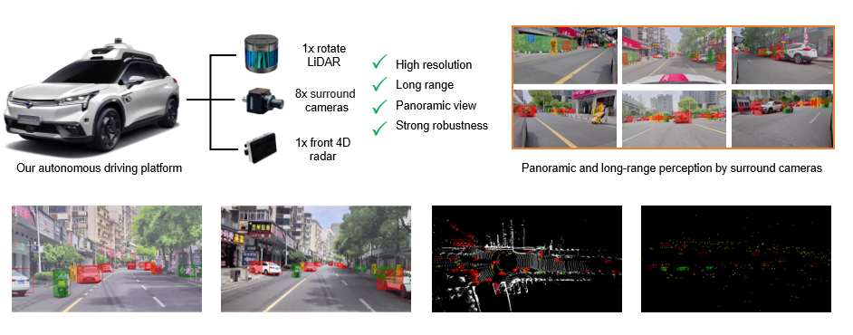
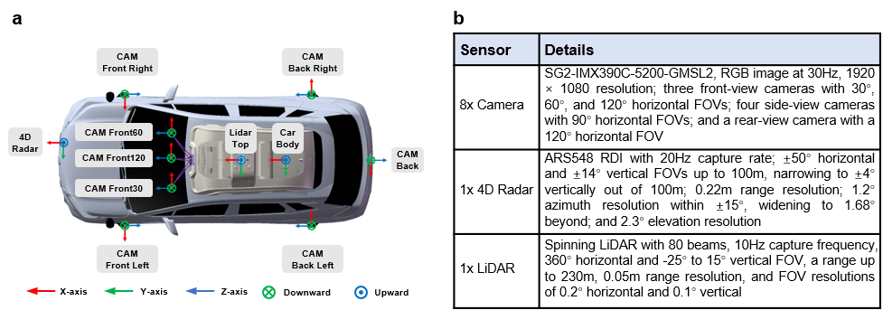

<p align="center">
  
</p>

# M<sup>2</sup>DSet: A Novel Multi-view and Multimodal dataset for Long-range and Robust Perception
We develop and release an innovative multi-view and multimodal dataset, dubbed M<sup>2</sup>DSet. M<sup>2</sup>DSet surpasses existing datasets with higher-resolution, longer-range, and more robust multimodal sensors (Fig. 1c). It provides 360° image data, 4D radar data, and LiDAR data, enabling a comprehensive perception capability. As an emerging range sensor, 4D radar can offer complete measurement of 3D position, as well as denser point clouds than 3D radar. These enhancements are particularly valuable in complex driving conditions, especially under adverse weather conditions. Importantly, M2DSet incorporates high-precision and long-range annotations up to 210 meters, significantly extending the practical range for 3D object detection. Another distinctive aspect of M<sup>2</sup>DSet is the inclusion of three front-view cameras with varying focal lengths. This deliberate design significantly enhances both the perceptual range and accuracy of the vision system. Additionally, this design can improve the image feature extraction of distant objects, thus facilitating more effective fusion with long-range sensor data, such as LiDAR or 4D radar. To the best of our knowledge, M<sup>2</sup>DSet is the first publicly available AD dataset that incorporates LiDAR, cameras with various focal lengths, and 4D radar, uniquely designed to simultaneously support long-range, robust, and panoramic perception. 
</p>

<p align="center">
  
</p>

# News

[2024.05.10] Our Code currently supports some baselines including PETR, Pointpillars, and Second. 

# 1. Introduction
<p style=""text-align:justify; text-justify:interideograph;">
  In pursuit of a diverse and comprehensive dataset, extensive data collection is conducted in the cities of Zhuzhou and Changsha, China. The M2DSet dataset encompasses approximately 8 hours of meticulously gathered data, covering a broad spectrum of driving conditions. Data collection spans multiple time periods to capture the diverse traffic dynamics at different times of the day, thus enhancing the dataset's generalization capability. The dataset includes typical autonomous driving scenarios such as urban roads, suburban roads, highways, and tunnels, with additional nighttime data collections to further expand dataset diversity. Adverse weather conditions such as fog and rain scenarios are also incorporated. Following the data collection phase, manual processing is undertaken to curate a set of 17.2K key frames, selected at regular 0.5-second intervals. These frames are organized into 430 sequences, each depicting a unique driving scenario. Data capture is comprehensively executed using eight cameras, a top-mounted LiDAR, and a frontal 4D radar, ensuring 360° environmental coverage around the ego-vehicle.  This strategic assembly of data not only facilitates a robust and extensive coverage but also significantly enhances the dataset’s utility in developing advanced autonomous driving algorithms.
</p>

# 2. Overall architecture of the data collection platform
To enhance the long-range and multi-view capabilities essential for autonomous driving perception, we have developed an advanced multimodal perception system, as presented in Fig. 2a. This system comprises eight high-resolution cameras, a front-mounted 4D radar, and a top-mounted 80-line LiDAR. In autonomous driving scenarios, perception requirements vary with the ego-vehicle orientation. The frontal direction, being critical for navigation and safety, is often prioritized to achieve enhanced perception capabilities 30, 39. Accordingly, our platform incorporates three front-view cameras with varying focal lengths and field-of-view (FOV) characteristics. The remaining five cameras are strategically distributed around the vehicle to work in conjunction with the front-view cameras, providing comprehensive panoramic coverage. This configuration enables our vision system to achieve a detailed understanding of the surrounding environment while maintaining long-range detection capabilities. Additionally, a high-resolution and long-range LiDAR is mounted on the vehicle’s roof, which can significantly enhance the 3D perception capability by providing accurate location and geometric information of surrounding objects. Robustness in autonomous driving systems is essential, particularly under adverse driving conditions. While LiDAR is effective across various lighting conditions, it has limitations in adverse weather due to point cloud degradation. To address these challenges, a 4D radar is integrated into the system, bolstering the overall robustness of the perception mechanisms. 
</p>

<div align=center>

</div>
<p align="center"><font face="Helvetica" size=3.><b>Fig. 2 | Sensor Configuration and Specifications of the M<sup>2</sup>DSet Data Collection Platform.</b></font></p>

# 3. Quanttitative Analysis
TO DO
The quantitative analysis of our dataset will be published as soon as our paper is accepted.

# 4. Download Link
* Our dataset is freely available to researchers. Please download and sign our [agreement](https://drive.google.com/file/d/1Zl9sTGBCUQAH0Kn4_66URL8d9f6tqVWr/view?usp=drive_link) and send it to the provided email address (<b>jzhong_l@163.com, yanglinSJTU@126.com</b>). You will receive the download link as soon as our paper is accepted. We will update the status in the "News" section.

* When unzipping the data, please file and organize it by following the format below:
```
    └─L-RadSet
    ├─ImageSets.zip
    ├─calibs.zip
    ├─labels.zip
    ├─labels_2d.zip
    ├─timestamp.zip
    ├─images
    │  ├─image_0.zip
    │  ├─image_1.zip
    │  ├─image_2.zip
    ......
    │  ├─image_7.zip
    ├─lidar.zip
    ├─radar.zip
    ├─detection.json
    ├─detection_long.json
    └─README.md
```
* This folder contains 17200 frames of labeled pointclouds and image data. The structure of the folder can be softly linked in data folder. The entire structure is shown as blow:
```
    └─L-RadSet
    ├─ImageSets
    │      test.txt
    │      train.txt
    │      trainval.txt
    │      val.txt
    ├─calib
    │  ├─ 000000.txt
          ..........
    ├─image
    |  ├─image_0
    |  │ │ 000000.png	
    │  │   ..........
    |  ├─image_1
    |  │ │ 000000.png	
    │  │ | ..........
    |  ├─image_2
    |  │ │ 000000.png	
    │  │ | ..........
    ......
    |  ├─image_7
    |  │ │ 000000.png	
    │  │ | ..........
    ├─lidar
    │  │ 000000.bin	# point cloud in bin format.
    │  │ ..........
    ├─radar
    │  │ 000000.bin	# point cloud in bin format.
    │  │ ..........
    ├─labels
    │  │ 000000.txt	# Label in txt format.
    │  │ ..........
    ├─labels_2d
    |  ├─image_0
    |  │ │ 000000.txt	# 2D Label in txt format.
    │  │   ..........
    |  ├─image_1
    |  │ │ 000000.txt	# 2D Label in txt format.
    │  │ | ..........
    |  ├─image_2
    |  │ │ 000000.txt	# 2D Label in txt format.
    │  │ | ..........
    ......
    |  ├─image_7
    |  │ │ 000000.txt	# 2D Label in txt format.
    │  │ | ..........
    ├─timestamp
    │  │ 000000.txt	# timestamp in txt format.
    │  │ ..........
    ├─anchor_size.json
    ├─detection.json
    ├─detection_long.json
    └─README.md
```
# 5. The Description of Calib Format

* The calib.txt contains three parts. 
```
   Intrinsics of each camera: matrix P(4×4)
   Extrinsics of LiDAR to each camera: matrix P(4×4)
   Distortion parameters: matrix P(1×5)
```
# 6. Label Files Discription
* <b>All values (numerical or strings) are separated via spaces, each row corresponds to one object. The 19 columns represent:</b>
```
  Value       Name             Description
  -------------------------------------------------------------------------------------------------------
  1        type               Describes the type of object: 'Car', 'Bus', 'Truck', 'Motorbike',  'Bicycle', 'Person', 'Child', 'Traffic_cone' and 'Barrier'
  1        truncated          Float from 0 (non-truncated) to 1 (truncated), where truncated refers to the object leaving image boundaries
  1        occluded           Integer (0,1,2,3) indicating occlusion state: 0 = fully visible, 1 = partly ccluded, 2 = largely occluded, 3 = unknown
  1        alpha              Observation angle of object, ranging [-pi..pi]
  4        bbox               2D bounding box of object in the image (0-based index): contains left, top, right, bottom pixel coordinates. (0, 0, 0, 0)
  3        dimensions         3D object dimensions: height, width, length (in meters).
  3        location           3D object location x,y,z in LiDAR coordinates (in meters).
  1        rotation_y         Rotation ry around Z-axis in LiDAR coordinates [-pi..pi].
  1        score              Only for results: Float,indicating confidence in detection, needed for p/r curves , higher is better.
 ```

# 7. Getting Started

### Environment
This is the documentation for how to use our detection frameworks with L-RadSet dataset.
We test the L-RadSet detection frameworks on the following environment:

* Python 3.8.16
* Ubuntu 18.04
* Torch 1.9.1+cu111 or higher
* CUDA 11.1 or higher
* mmdet3d 1.1.1
* mmdet 3.0.0rc5
* mmengine 0.7.4
* setuptools 58.0.4

### Preparing The Dataset

* After all files are downloaded, please arrange the workspace directory with the following structure:


* Organize your code structure under mmdetection3d framework, as follows
```
    mmdetection3d
      ├── checkpoints
      ├── configs
      ├── data
      │  │  M<sup>2</sup>DSet
      ├── mmdet3d
      ├── projects
      ├── tools
      ├── work_dirs
```
### Requirements

* Clone the repository

```
 git clone https://github.com/ME_SJTU/M2DSet.git
```

* Create a conda environment\
You can follow the official installation of [mmdetection3d](https://mmdetection3d.readthedocs.io/en/latest/get_started.html) 
* Note
1. Change the mmdetection3d version into 1.1.1 before you compile it
```
 git checkout v1.1.1
```
2. Put the our files into the corresponding folders

### Train & Evaluation
* Generate the data infos by running the following command
1. using lidar & image data
```
python tools/create_data.py m2dset --root-path ./data/m2dset --out-dir ./data/m2dset --extra-tag m2dset 
```

2. using 4D radar & image data
```
python tools/create_data.py radset --root-path ./data/m2dset --out-dir ./data/m2dset --extra-tag m2dset
```

* To train the model on single GPU, prepare the total dataset and run
```
python train.py ${CONFIG_FILE}
```
* To train the model on multi-GPUs, prepare the total dataset and run
```
tools/dist_train.sh ${CONFIG_FILE} ${NUM_GPUS} 
```
* To evaluate the model on single GPU, modify the path and run
```
python test.py ${CONFIG_FILE} ${CKPT}
```
* To evaluate the model on multi-GPUs, modify the path and run
```
tools/dist_train.sh ${CONFIG_FILE} ${CKPT} ${NUM_GPUS} 
```
