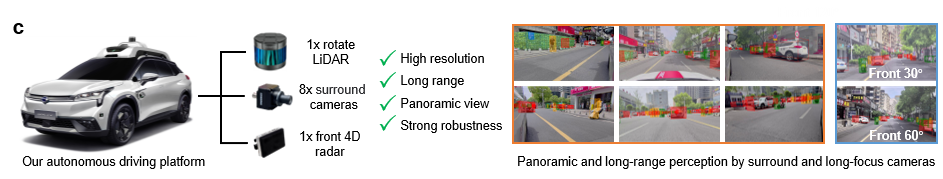

  

# M2DSet: A Novel Multi-view and Multimodal dataset for Long-range and Robust Perception
We develop and release an innovative multi-view and multimodal dataset, dubbed M2DSet. M2DSet surpasses existing datasets with higher-resolution, longer-range, and more robust multimodal sensors (Fig. 1c). It provides 360° image data, 4D radar data, and LiDAR data, enabling a comprehensive perception capability. As an emerging range sensor, 4D radar can offer complete measurement of 3D position, as well as denser point clouds than 3D radar. These enhancements are particularly valuable in complex driving conditions, especially under adverse weather conditions. Importantly, M2DSet incorporates high-precision and long-range annotations up to 210 meters, significantly extending the practical range for 3D object detection. Another distinctive aspect of M2DSet is the inclusion of three front-view cameras with varying focal lengths. This deliberate design significantly enhances both the perceptual range and accuracy of the vision system. Additionally, this design can improve the image feature extraction of distant objects, thus facilitating more effective fusion with long-range sensor data, such as LiDAR or 4D radar. To the best of our knowledge, M2DSet is the first publicly available AD dataset that incorporates LiDAR, cameras with various focal lengths, and 4D radar, uniquely designed to simultaneously support long-range, robust, and panoramic perception. 

  

# News

[2024.05.10] Our Code currently supports some baselines including DETR3D, Pointpillars, Second, and PV-RCNN. 

# 1. Introduction

  In pursuit of a diverse and comprehensive dataset, extensive data collection is conducted in the cities of Zhuzhou and Changsha, China. The M2DSet dataset encompasses approximately 8 hours of meticulously gathered data, covering a broad spectrum of driving conditions. Data collection spans multiple time periods to capture the diverse traffic dynamics at different times of the day, thus enhancing the dataset's generalization capability. The dataset includes typical autonomous driving scenarios such as urban roads, suburban roads, highways, and tunnels, with additional nighttime data collections to further expand dataset diversity. Adverse weather conditions such as fog and rain scenarios are also incorporated. Following the data collection phase, manual processing is undertaken to curate a set of 17.2K key frames, selected at regular 0.5-second intervals. These frames are organized into 430 sequences, each depicting a unique driving scenario. Data capture is comprehensively executed using eight cameras, a top-mounted LiDAR, and a frontal 4D radar, ensuring 360° environmental coverage around the ego-vehicle.  This strategic assembly of data not only facilitates a robust and extensive coverage but also significantly enhances the dataset’s utility in developing advanced autonomous driving algorithms.
